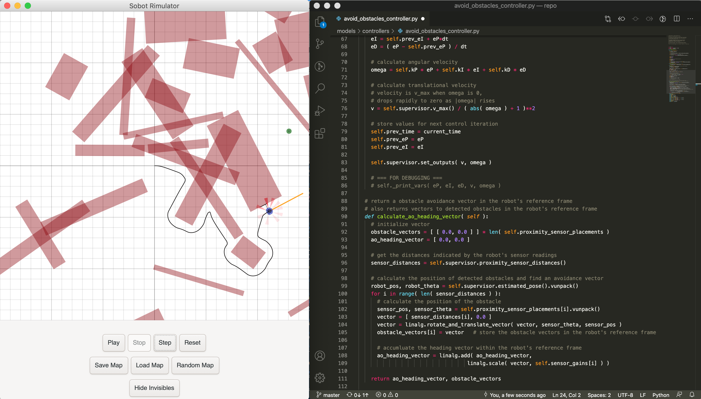
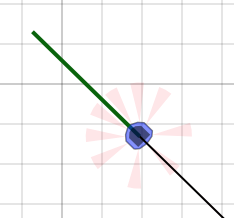
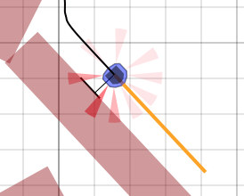

# Sobot Rimulator

A robot programming tool.



Sobot Rimulator is inspired by [Sim.I.Am](http://jpdelacroix.com/software/simiam.html), a Matlab simulator written by [JP de la Croix](http://jpdelacroix.com/). The software simulates a [Khepera III](https://ftp.k-team.com/KheperaIII/UserManual/Kh3.Robot.UserManual.pdf) robot navigating to a goal in an environment of obstacles. The control system packaged with this software is based on the principles of [hybrid automata](https://en.wikipedia.org/wiki/Hybrid_automaton), as taught by [Magnus Egerstedt](https://magnus.ece.gatech.edu/) for the Coursera course [Control of Mobile Robots](https://www.coursera.org/learn/mobile-robot).

An in-depth discussion of these principles is given in [this article](https://www.toptal.com/robotics/programming-a-robot-an-introductory-tutorial) on the Toptal Engineering Blog.

## Table of Contents

[Getting Started](#getting-started)
[User Interface](#user-interface)

## Getting Started

### Requirements

Sobot Rimulator requires Python 3. Its main dependencies are Gtk 3 and PyGObject, which are used for the UI.

If you are using `pip` you will need to add Gtk3 to your environment separately since it is not a Python library. If you are using `conda` you can create a a new environment with everything you need like this:

```
conda create -n sobot-rimulator -c conda-forge python=3 gtk3 pygobject
```

Then to switch to the new environment:

```
conda activate sobot-rimulator
```

### Running the Simulator

From the command line, navigate to the project's root directory. Then type:

```
python simulator.py
```

## User Interface

The simulator interface contains the following elements:

- [Simulation Viewport](#simulation-viewport)
- [Alert Text Panel](#alert-text-panel)
- [Control Panel](#control-panel)

  

### Simulation Viewport

When the program starts, a randomized map is loaded.

A small blue and black circular object in the center of the viewport is the robot. The dimensions and capabilities of this robot are modeled after the [Khepera III](https://ftp.k-team.com/KheperaIII/UserManual/Kh3.Robot.UserManual.pdf) research robot. The Khepera III is a differential-drive mobile robot. It is equipped with 9 infrared proximity sensors forming a "skirt", with which it can detect nearby obstacles.

A green circle indicates the location of the goal the robot will attempt to reach.

Red rectangles scattered throughout the map are obstacles - if the robot makes contact with an obstacle, a collision will occur and the simulation will end.

A grid is drawn onto the map to help you judge distances. Major gridlines are laid out every meter. Minor gridlines are laid out every 20 centimeters.

### Alert Text Panel

When events such as a collision or successful arrival at the goal occur, it will be reported in the space between the simulation view port and the control panel. When the simulation begins, the alert text panel is blank.

### Control Panel

The control panel is divided into three rows.

The first row of buttons controls the simulation progress:

- **"Play"** - Causes the simulation to proceed until you stop it, or the robot reaches the goal or collides with an obstacle.

- **"Stop"** - Stops the simulation in its current state.

- **"Step"** - Advances the simulation by one simulation cycle. The simulation will be stopped after this button is pressed.

- **"Reset"** - Clears all progress of the robot and resets the simulation.

The second row of buttons gives you control over the map:

- **"Save Map"** - Opens a save dialog. The default location to save maps is in the `/maps` folder of the simulator directory. Saving a map will NOT save the current state of the simulation. It only saves the location of the obstacles and the goal.

- **"Load Map"** - Opens a load dialog. From here you can load previously saved maps.

- **"Random Map"** - Generates a random map on the fly. The simulation resets when a new random map is generated.

The third row of buttons provides a more detailed visualization of what the robot is doing:

- **"Show Invisibles"** - Causes extra information to be drawn to the simulation view that would not be visible in the real world. This includes the robot's traverse path (where it has been so far), the robot's infrared sensor cones, the robot's current desired heading, and other information specific to the current control mode the robot is in:

  - A green heading bar indicates that the robot is currently in **Go to Goal** mode.

    

  - A red heading bar indicates that the robot is currently in **Avoid Obstacles** mode. This will be accompanied by a black outline indicating the robot's detected surroundings.

    

  - An orange heading bar indicates that the robot is currently in **Follow Wall** mode. This will be accompanied by two black lines - one indicating the followed surface calculated by the robot, and another indicating the stand-off distance to that obstacle surface.

    
